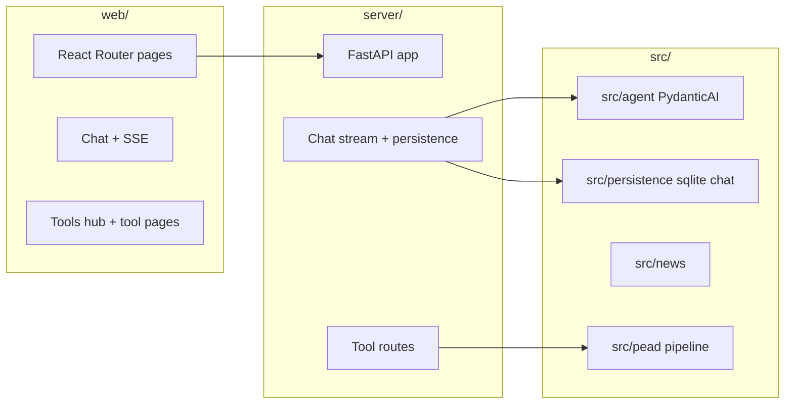

# System patterns

## High-level layout

## Chat streaming (web)

- **While `loading` on the latest assistant message:** render **plain** `whitespace-pre-wrap` (no Markdown parse per token).
- **After stream ends:** render **Markdown** (`MarkdownContent`: react-markdown + remark-gfm).
- **Scroll:** `stickToBottomRef` + `useLayoutEffect` on `messages` / `toolLog` / `loading`; double `requestAnimationFrame` before setting `scrollTop`. User can scroll up; “Jump to latest” when not following.
- **Layout:** App shell uses `flex` + `min-h-0` so the chat pane scrolls inside the viewport, not the whole page.

## Backend

- FastAPI entry: `server/app.py`; tool wiring `server/tools_routes.py`.
- Chat storage: SQLite helpers under `src/persistence/` (e.g. `sqlite_chat.py`).

## Agents

- Coordinator + tools; synthesis via tool when narrative polish requested. Model strings via PydanticAI (`OPENAI_API_KEY` required for chat).

## Outputs

- Traditional runs: timestamped folders under `output/`; agent runs default under `output/agent_runs/` where applicable.
