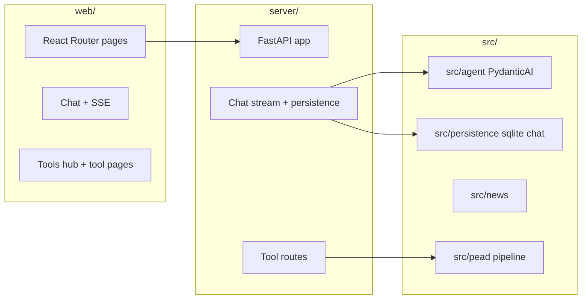

# System patterns

## High-level layout

## Chat streaming (web)

- **While `loading` on the latest assistant message:** render **plain** `whitespace-pre-wrap` (no Markdown parse per token).
- **After stream ends:** render **Markdown** (`MarkdownContent`: react-markdown + remark-gfm).
- **Scroll:** `stickToBottomRef` + `useLayoutEffect` on `messages` / `toolLog` / `loading`; double `requestAnimationFrame` before setting `scrollTop`. User can scroll up; “Jump to latest” when not following.
- **Layout:** App shell uses `flex` + `min-h-0` so the chat pane scrolls inside the viewport, not the whole page.

## Backend

- FastAPI entry: `server/app.py`; tool wiring `server/tools_routes.py`.
- Chat storage: SQLite helpers under `src/persistence/` (e.g. `sqlite_chat.py`).

## News stack (short)

- **Collector** (`src/news/collector.py`) merges RSS / search / HTML discovery into `NewsArticle` list; optional **scrape** enriches bodies (`src/news/article_scraper.py`).
- **Layer** (`src/news/layer.py`, `src/news/market_sentiment_layer.py`) → **`run_news_sentiment_pipeline`** (`src/news/sentiment_pipeline.py`): lexicon, optional headline LLM synthesis, **`run_news_ai_digest`** (final narrative) — digest is optional per-run via `include_ai_digest` / equity-run options.
- **Preview for API/UI:** `build_article_preview_rows` (`src/news/article_preview.py`) — avoids losing undated tail items in `articles_preview`.
- **Citations:** `NewsArticleStore.persist_fetch` (`src/persistence/sqlite_news_articles.py`) writes `news_article_citations` (same default SQLite file family as chat unless `NEWS_SQLITE_PATH` overrides).

## Agents

- Coordinator + tools; synthesis via tool when narrative polish requested. Model strings via PydanticAI (`OPENAI_API_KEY` required for chat).

## Outputs

- Traditional runs: timestamped folders under `output/`; agent runs default under `output/agent_runs/` where applicable.
