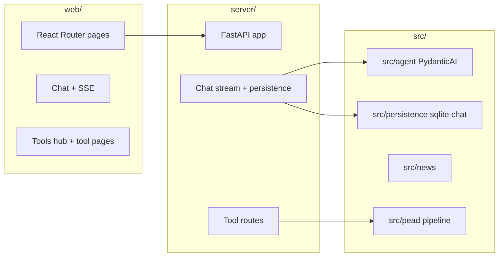

# System patterns

## High-level layout

## Chat streaming (web)

- **While `loading` on the latest assistant message:** render **plain** `whitespace-pre-wrap` (no Markdown parse per token).
- **After stream ends:** render **Markdown** (`MarkdownContent`: react-markdown + remark-gfm).
- **Scroll:** `stickToBottomRef` + `useLayoutEffect` on `messages` / `toolLog` / `loading`; double `requestAnimationFrame` before setting `scrollTop`. User can scroll up; “Jump to latest” when not following.
- **Layout:** App shell uses `flex` + `min-h-0` so the chat pane scrolls inside the viewport, not the whole page.

## Backend

- FastAPI entry: `server/app.py`; tool wiring `server/tools_routes.py`.
- Chat storage: SQLite helpers under `src/persistence/` (e.g. `sqlite_chat.py`).

## Data layer (OHLCV)

- **`DataManager`** (`src/data/data_manager.py`): tries NSE equity OHLCV first, then Yahoo and optionally **jugaad-data** when the window is short or empty; merge order documented in-module. Market index series: NSE **NIFTY 50** + Yahoo **`MARKET_INDEX`** for backfill.
- **Logging:** Prefer structured prefixes **`data_fetch`** (per vendor) and **`data_manager.get_stock_data` / `get_market_data`** (cache hit/miss, fallback reason) for operations and debugging.

## Equity research pipeline (observability)

- **`StockAnalyzer.analyze_equity_research`** builds **`EquityResearchRunContext`**, **`equity_research_log_adapter`**, runs **`select_equity_research_stages`** → **`execute_pipeline`** (`src/equity_research_pipeline/runner.py`).
- **`pipeline_trace`** (and scoring-only **`scoring_pipeline_trace`**) record **`stage`**, **`duration_ms`**, **`ok`**. Log lines include **`run_id`** and **`symbol`** in message text for default formatters; per-stage detail in **`full_run_steps`** / **`scoring_steps`**.

## News stack (current — post Issue #2)

Full pipeline: Collector → title-fingerprint dedup → sentiment pipeline (weighted) → signals → ai_digest.

**Source tier:**
- Tier 1 (0.90–1.0): NSE/BSE Announcement, Reuters, PTI, Bloomberg
- Tier 2 (0.70–0.89): Business Standard, Mint, NDTV Profit, BusinessLine, Financial Express, Economic Times, MoneyControl, CNBCTV18
- Tier 3 (0.40–0.69): Yahoo, Google News, Bing News, aggregators
- Tier 4 (0.10–0.39): HTML discovery, undated sources

**Modules:**
- `src/news/source_registry.py` — credibility weights; `get_source_weight(source_label)` → float
- `src/news/dedup.py` — `dedup_by_title(articles)` → deduplicated list (SHA-1 fingerprint, keeps highest-weight source)
- `src/news/event_classifier.py` — `classify_event(article)` → EventType string; 150+ keyword rules
- `src/news/news_signals.py` — `compute_all_signals(articles_data, window_start, window_end)` → velocity + agreement + event_tone
- `src/news/exchange_announcements.py` — `fetch_exchange_announcements(symbol, start, end)` → `List[NewsArticle]` from NSE API; `build_announcements_summary()` for API
- **Collector** (`src/news/collector.py`): Yahoo / Google RSS (date-chunked) / Bing / DDG / 7 built-in Tier-2 India RSS feeds / HTML discovery / configurable RSS / optional NewsAPI → title dedup at end
- **Layer** (`src/news/layer.py`, `src/news/market_sentiment_layer.py`) → `run_news_sentiment_pipeline` with window args
- **Sentiment pipeline** (`src/news/sentiment_pipeline.py`): source-credibility × event-type weighted scoring; `coverage_meta`; `news_signals`; `per_article` with event_type + source_weight + source_tier
- **Preview for API/UI:** `build_article_preview_rows` (`src/news/article_preview.py`)
- **Citations:** `NewsArticleStore.persist_fetch` (`src/persistence/sqlite_news_articles.py`)

**New pipeline stage:** `run_exchange_announcements` (between fundamentals and technical in `EQUITY_RESEARCH_FULL_STAGES`).

**New standalone route:** `POST /api/tools/run/exchange-announcements`.

**Logging prefixes:** `news_ingest.source` (per-source count), `news_dedup` (removed count), structured stage logs `equity_research.stage.run_exchange_announcements`.

## Agents

- Coordinator + tools; synthesis via tool when narrative polish requested. Model strings via PydanticAI (`OPENAI_API_KEY` required for chat).

## Outputs

- Traditional runs: timestamped folders under `output/`; agent runs default under `output/agent_runs/` where applicable.
